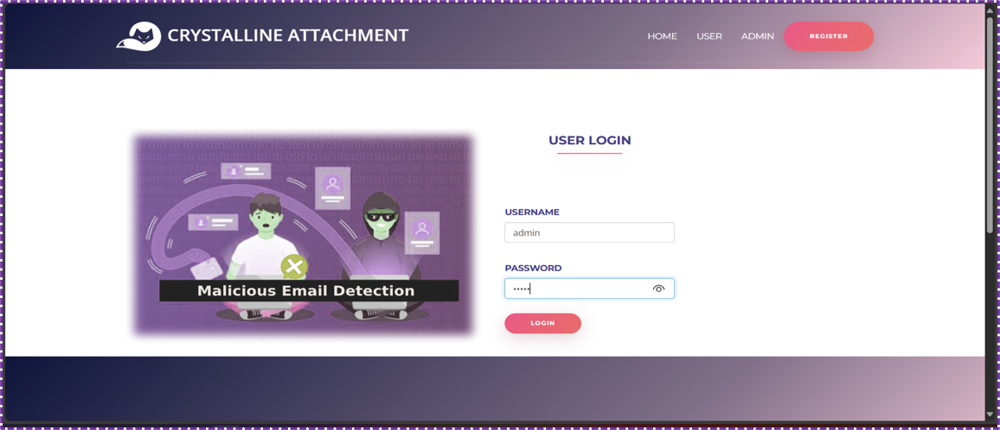
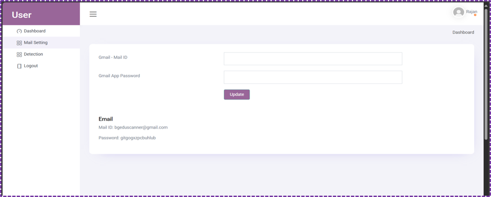
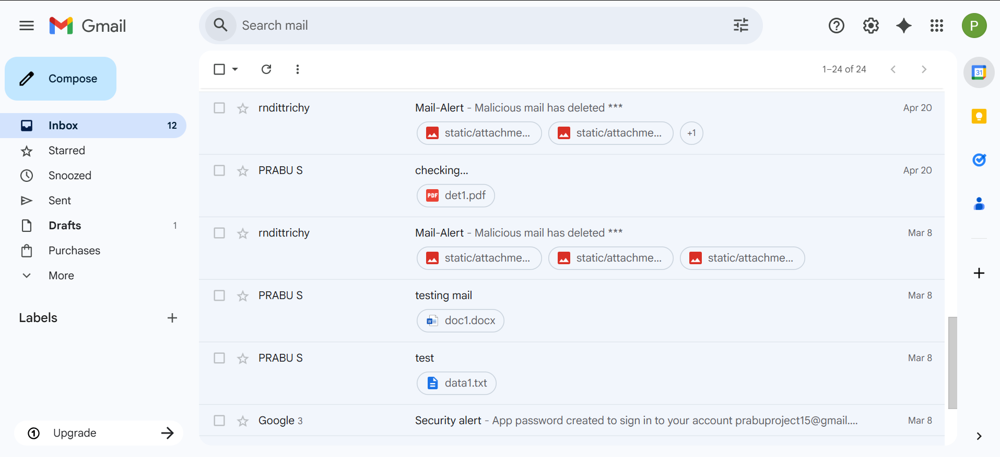
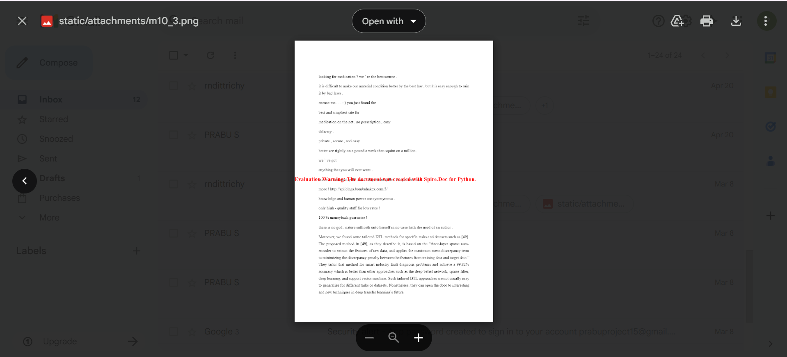
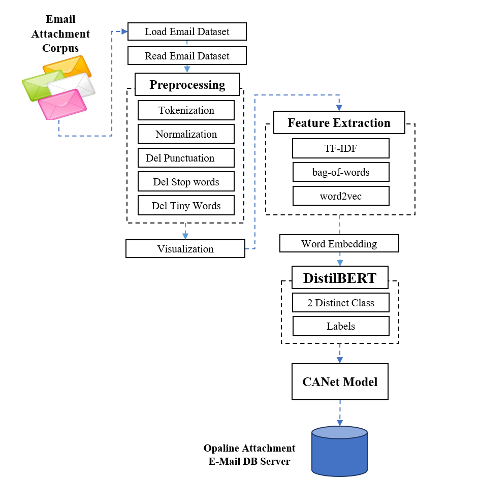
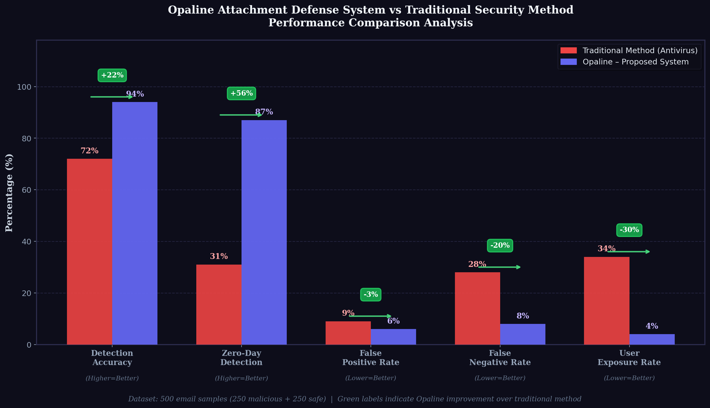

# Opaline-Attachment-Defense-System
An AI-powered email attachment defense system using DistilBERT for malicious file detection and sandboxed PNG rendering

<div align="center">


# 🛡️ Opaline Attachment Defense System

### AI-Powered Malicious Email Attachment Detection & Sandboxed Rendering

*Final Year B.Tech Project — Department of Information Technology*
*PSV College of Engineering & Technology, Tirupattur (Affiliated to Anna University, Chennai)*

</div>

---

## 📌 Overview

**Opaline Attachment Defense System** is an intelligent email security solution
that detects and neutralizes malicious email attachments using the
**DistilBERT deep learning model**. Instead of relying on outdated
signature-based antivirus methods, Opaline analyzes the semantic content
of attachments and converts flagged files into **static PNG images** inside
a sandboxed environment — preventing malicious code execution entirely.

> ✅ Detection Accuracy: **94%** &nbsp;|&nbsp;
> ⚡ Zero-Day Detection: **87%** &nbsp;|&nbsp;
> 🕒 Avg. Processing Time: **8.3s/file**

---

## 🔥 Key Features

| Feature | Description |
|--------|-------------|
| 🤖 DistilBERT Classification | Semantic NLP-based detection of malicious content |
| 🖼️ PNG Sandboxed Rendering | Converts flagged attachments to static safe images |
| 🔔 Real-Time Alerts | Instant user notification on threat detection |
| 👤 Role-Based Access | Separate Admin and User dashboards |
| 📊 Model Training Pipeline | Upload dataset → preprocess → train → deploy |
| 🗄️ MySQL Logging | Full audit trail of detections and conversions |


Email Received
│
▼
┌─────────────────────┐
│  Attachment Extractor│
└────────┬────────────┘
│
▼
┌─────────────────────┐
│  DistilBERT (CANet) │  ◄── NLP Classification
│  Safe / Malicious   │
└────────┬────────────┘
│
┌────┴────┐
▼         ▼
SAFE     MALICIOUS
↓           ↓
Download   PNG Render
+ Alert

---

## 📊 Performance vs Traditional Method

| Parameter | Traditional (Antivirus) | Opaline | Improvement |
|-----------|------------------------|---------|-------------|
| Detection Accuracy | 72% | **94%** | +22% |
| Zero-Day Detection | 31% | **87%** | +56% |
| False Negative Rate | 28% | **8%** | −20% |
| User Exposure Rate | 34% | **4%** | −30% |
| Processing Speed | 12s | **8.3s** | −31% |

---

## 🛠️ Tech Stack

**Backend:** Python 3.8, Flask
**Frontend:** React JS, Bootstrap 4
**Database:** MySQL 5, WampServer
**ML/AI:** TensorFlow, DistilBERT (Hugging Face), Scikit-Learn
**Libraries:** Pandas, NumPy, Matplotlib, Pillow
**Email Protocol:** IMAP, SMTP

---

## 📁 Repository Structure
Opaline-Attachment-Defense-System/
├── src/
│   ├── app.py              # Flask main application
│   ├── model/
│   │   ├── canet_model.py  # DistilBERT model definition
│   │   ├── train.py        # Training pipeline
│   │   └── predict.py      # Inference module
│   ├── static/             # CSS, JS, assets
│   └── templates/          # HTML templates
├── dataset/
│   └── README.md           # Dataset info & source
├── docs/
│   ├── Report.pdf          # Full project report
│   ├── result_analysis.png # Performance comparison chart
│   └── screenshots/        # Application screenshots
├── requirements.txt
├── setup.md
└── README.md

---

## ⚙️ Setup & Installation

> See [setup.md](setup.md) for detailed steps.

**Quick Start:**

```bash
# 1. Clone the repository
git clone https://github.com/YOUR_USERNAME/Opaline-Attachment-Defense-System.git
cd Opaline-Attachment-Defense-System

# 2. Install dependencies
pip install -r requirements.txt

# 3. Set up MySQL database
# Import the schema from docs/database_schema.sql

# 4. Run the application
python src/app.py
```

Open browser → `http://localhost:5000`

---

## 📸 Screenshots

<table>
  <tr>
    <td><br/><sub>Login Page</sub></td>
    <td><br/><sub>Admin Dashboard</sub></td>
  </tr>
  <tr>
    <td><br/><sub>Email Inbox View</sub></td>
    <td><br/><sub>Threat Detection Alert</sub></td>
  </tr>
  <tr>
    <td><br/><sub>Safe PNG Rendering</sub></td>
    <td><br/><sub>Model Training Pipeline</sub></td>
  </tr>
</table>

---

## 📈 Result Analysis

<div align="center">
  
</div>

---

## 🎓 Academic Details

| Detail | Info |
|--------|------|
| Degree | B.Tech – Information Technology |
| Institution | PSV College of Engineering & Technology |
| University | Anna University, Chennai |
| Batch | 2022 – 2026 |
| Project Type | Final Year Major Project |

---

## 📄 License

This project is licensed under the **MIT License** —
see the [LICENSE](LICENSE) file for details.

---

## 🤝 Connect

[](https://linkedin.com/in/prabu-s)
[](mailto:prabhutpt2004@gmail.com)

---

<div align="center">
  <sub>Built with ❤️ for a safer email ecosystem</sub>
</div>
---

## 🏗️ System Architecture
